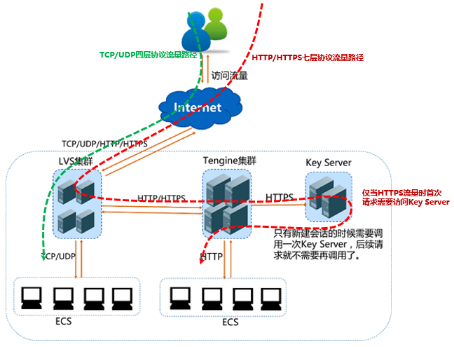

十六 网络通信与诊断
=============

K8S 的网络通信完全由 CNI
接口上的插件来实现，插件需要实现以下集中通信模型。

目前比较流行的插件有：flannel、calico、canel、kube-router …

-  如何加载插件

k8s 在启动的时候会去：/etc/cni/net.d/ 目录下寻找网络插件的配置文件，POD
在创建时候 k8s 调用这个配置文件，由插件根据这个配置文件进行创建网络。

16.1 通信模型
-------------

1. 容器间通信：同一个 POD 内多个容器间的通信，使用 lo 网卡通信
2. POD间通信：POD IP 直接与 POD IP 通信
3. POD 与 Service：POD IP 直接与 Cluster IP
4. Service 与集群外部客户端的通信，ingress、NodePort、Loadbacer

16.2 通信模型底层
-----------------

无论哪一种网络插件，它们用到的底层方案都是以下几种：

1. 虚拟网桥：brg，用纯软件实现一个虚拟网卡，一端在POD上，一端在宿主机上接入到网桥或物理接口桥上，称为隧道网络。
2. 多路复用：MacVLAN，基于 MAC 的方式创建 VLAN
   ，为每个虚拟接口配置一个独立的 MAC
   地址，使得一个物理网卡承载多个容器使用，这样容器直接使用物理网卡，基于
   MacVLAN 进行跨节点通信。
3. 硬件交换：网卡支持硬件交换，SR-IOV （单根-IO虚拟化）
   方式，这种网卡支持直接在物理级别虚拟出多个接口，高性能。

16.3 K8S 名称空间
-----------------

K8S 名称空间与 POD 网络名称空间不在一个维度，所以即使在不同的 K8S
集群名称空间内创建的不同 POD，也可以通过网络直接通信。

而目前应用最广的 flannel
网络插件，是不支持这种不同集群命名空间的网络隔离策略的。

calico
支持地址分配，也支持不同集群命名空间的网络隔离策略，但是它使用较为复杂，支持
BGP 三层网络转发，性能比 flannel 强。

也可以使用 flannel 来做网络管理，再安装 calico
仅仅做集群命名空间网路隔离策略，这种搭配方案。

16.4 K8S网络拓扑
----------------

所有 POD 连接到，本机 cni0 接口这个网络，cni0 接口发出的报文到达
flannel.1
这个接口，这个接口将报文封装为隧道协议，通过本机的真实的物理网卡发出。

-  查看本机的接口


   1: lo:                       # 本地回环
   2: ens33:                    # 主机物理网卡
   3: docker0:                  # docker 默认的桥接网络，在 k8s 中无用可以删除
   4: dummy0:                   # 
   5: kube-ipvs0:               # 
   6: flannel.1:                # flannel 虚拟网卡，封装隧道报文
   7: cni0:                     # 所有容器处于这个网桥
   8: veth0c014b8b@if3:         # 容器的网卡连接到 cni0
   9: veth97c048e5@if3:         # 容器的网卡连接到 cni0
   11: vethd2f0bf2b@if3:        # 容器的网卡连接到 cni0
   12: veth648a500f@if3:        # 容器的网卡连接到 cni0

-  下载 bridge-utils 包使用命令 brctl show cni0 查看 cni0 接口


   bridge    name    bridge id           STP    enabled    interfaces
   cni0              8000.9a6ec95f8285   no                veth0c014b8b
                                                           veth648a500f
                                                           veth7a3f56b7
                                                           veth97c048e5
                                                           vethd2f0bf2b

16.5 flannel
------------

flannel 是一个专为 kubernetes
定制的三层网络解决方案，主要用于解决容器的跨主机通信问题。

### 16.5.1 flannel 工作模式

-  flannel.1
   这个虚拟网卡支持多种传输模式：VxLAN、host-gw、Directrouting、udp

```
+-----------+----------------------------------------------------------+
| 模式      | 介绍                                                     |
+===========+==========================================================+
| VXLAN     | 使用 VxLAN 作为隧道封装报文                              |
+-----------+----------------------------------------------------------+
| host-gw   | 不使用叠加网络，而是在主机的路由表中创建到其他主机       |
|           | subnet 的路由条目，性能较好，缺陷是：所有 node           |
|           | 节点必须处于同一个二层网络中。                           |
+-----------+----------------------------------------------------------+
| DirectRou | 当主机位于同一子网时启用直接路由，不在回退到 VxLAN。     |
| ting      |                                                          |
+-----------+----------------------------------------------------------+
| UDP       | 直接使用 UDP 协议，性能差                                |
+-----------+----------------------------------------------------------+
```

### 16.5.2 VXLAN 通信过程

Flannel VXLAN 实质上是一种 “覆盖网络(overlay network)”
，也就是将TCP数据包装在另一种网络包里面进行路由转发和通信，目前已经支持UDP、VxLAN、AWS
VPC和GCE路由等数据转发方式。

-  flannel VXLAN 通信过程

在 K8S 上 POD 与 POD 是直接通过对方的 IP 地址进行通信的，POD
发出的报文经过 cni0 网桥到达 flannel ，flannel 将报文封装上一层 VxLAN
的首部，外层又被封装一层 UDP
协议的首部，发送给本机物理网卡，本机物理网卡又将 flannel
发过来的报文外层封装上 IP 首部和以太网帧首部（MAC）由网卡发出，另外一个
node 节点收到报文，内核发现是一个 VxLAN 的包，拆掉 IP 首部送给 flannel
应用程序，flannel 拆掉 VxLAN 首部并将内部的数据发送给，cni0 网桥，cni0
收到后转发给 POD。

```

   |                                               |                                   |
   |<------------------ VxLAN封装 ----------------->|<----------- 原始报文 ------------->|
   +-----------+-----------+-----------+-----------+-----------+-----------+-----------+
   |  node 网络 |  node网络  | node 网络 |  VxLan    |   POD MAC |  POD IP   |    data   |
   |  帧首部MAC |   IP首部   | UDP 首部  |   首部     |    首部    |   首部    |  Payload  |
   +-----------+-----------+-----------+-----------+-----------+-----------+-----------+
```

### 16.5.3 flannel 部署方式

1. 在 k8s 集群启动前，flannel 直接部署到节点上，作为一个守护进程运行。


   任何一个部署了 kubelet 的节点都应该部署 flannel ，因为 kubelet 要借助 flannel 为 POD 设置网络接口

2. 使用 kube-admin 直接将 k8s 自己的组件包括 flannel 运行在 k8s
   之上的静态 POD。


   必须配置为共享 node 节点网络名称空间的 POD，所以 flannel POD 控制器为 DaemonSet。

### 16.5.4flannel 配置文件


-  配置文件选项含义

```

   {
       "Network": "10.244.0.0/16",     // flannel 使用的 CIDR 格式的网络地址，用于为 POD 配置网络功能
       "SubnetLen": 24,                // 把 Network 切分为子网供各 node 节点使用时，使用多长的掩码切分，默认为 24
       "SubnetMin": "10.244.10.0/24",  // 用于分配给 node 的子网起始地址，从这个网络开始分配网络
       "SubnetMax": "10.244.255.0/24"  // 用于分配给 nide 的子网结束位置，这个是最大分配的网路  
       "Backend": {                    // 指明 POD 与 POD 跨节点通信时候使用的 flannel 工作模式
           "Type": "vxlan",            // 工作模式
           "Directrouting": true       // 是否使用直接路由模式
       }
   }
```

-  flannel 托管到 k8s 上的配置文件，处于 kube-flannel-cfg 这个 configmap
   中。


   kubectl get configmap kube-flannel-cfg -n kube-system -o json

### 16.5.5 修改工作模式


-  修改 flannel 工作模式，添加 Directrouting，这个操作应该在刚刚部署完
   k8s 集群时候修改，推荐修改


```
   kubectl edit configmap kube-flannel-cfg -n kube-system
   "Backend": {
       "Type": "vxlan",
       "Directrouting": true
   }
```

-  查看本机路由表


```
   ip route show
   default via 172.16.100.254 dev ens33 proto static metric 100 
   10.244.1.0/24 via 10.244.1.0 dev ens33             # 必须为 dev 物理网卡接口，否则 Directrouting 没有设置成功
   10.244.2.0/24 via 10.244.2.0 dev ens33             # 必须为 dev 物理网卡接口，否则 Directrouting 没有设置成功
   172.16.100.0/24 dev ens33 proto kernel scope link src 172.16.100.101 metric 100 
   172.17.0.0/16 dev docker0 proto kernel scope link src 172.17.0.1 
```

## 16.6 Calico


Calico 创建和管理⼀个扁平的三层网络(不需要
overlay)，每个容器会分配一个可路由的
ip。由于通信时不需要解包和封包，网络性能损耗小，易于排查，且易于水平扩展。

小规模部署时可以通过 bgp client 直接互联，大规模下可通过指定的 BGP route
reflector 来完成，这样保证所有的数据流量都是通过 IP
路由的方式完成互联的。

Calico 基于 iptables 还提供了丰富而灵活的网络
Policy，保证通过各个节点上的 ACLs 来提供 Workload
的多租户隔离、安全组以及其他可达性限制等功能。

有个新的项目：canel，它集合了 flannel 和 calico 的优点。

-  注意

Calico 目前不支持工作在 iptables 下的 kube-proxy，下面介绍 canal
网络策略的使用

### 16.6.1 安装 canal


-  下载清单文件，需要翻墙


   kubectl apply -f https://docs.projectcalico.org/v3.6/getting-started/kubernetes/installation/hosted/canal/canal.yaml

### 16.6.2 清单定义

-  清单格式，详见：kubectl explain networkpolicy


```
   egress                  <[]Object>    # 出站规则的对象列表
     ports                 <[]Object>    # 目标端口的对象列表
       port                <string>      # 数字形式或者是命名的端口
       protocol                          # 协议 TCP、UDP
     to                    <[]Object>    # 目标地址对象列表
       ipBlock             <Object>      # 一组 IP 地址
         cidr              <string>      # CIDR 表示的 IP 范围
         except            <[]string>    # 排除 CIDR 中的某些地址
       namespaceSelector   <Object>      # 名称空间选择器
       podSelector         <Object>      # POD 选择器，目标地址可以也是一组 POD
   ingress                 <[]Object>    # 入站规则的对象列表
     from                  <[]Object>    # 源地址对象列表
       ipBlock             <Object>      # 一组 IP 地址
         cidr              <string>      # CIDR 表示的 IP 范围
         except            <[]string>    # 排除 CIDR 中的某些地址
       namespaceSelector   <Object>      # 名称空间选择器
       podSelector         <Object>      # POD 选择器，源地址也可以是一组 POD
     ports                 <[]Object>    # POD 自己的端口，表示控制自己的端口是否可以被访问，的对象列表
       port                              # 数字形式或者是命名的端口
       protocol                          # 协议 TCP、UDP
   podSelector             <Object>      # POD 选择器决定规则应用在哪些 POD 上
   policyTypes             <[]string>    # 可以是 "Ingress", "Egress", 或者 "Ingress,Egress" ，表示放行满足这些规则访问
```

### 16.6.3 policyTypes

-  首先定义 名称空间


```
   kubectl create namespace dev
   kubectl create namespace prod
```

-  在两个命名空间分别创建一个 POD


```
   apiVersion: v1
   kind: Pod
   metadata:
     name: pod1
     namespace: dev
     labels:
       app: myapp
   spec:
     containers:
     - name: myapp
       image: ikubernetes/myapp:v1
       
   ---
   apiVersion: v1
   kind: Pod
   metadata:
     name: pod1
     namespace: prod
     labels:
       app: myapp
   spec:
     containers:
     - name: myapp
       image: ikubernetes/myapp:v1
```


   kubectl apply -f pod-a.yaml -n dev

-  拒绝所有 dev 空间的报文


```
   apiVersion: networking.k8s.io/v1
   kind: NetworkPolicy
   metadata:
     name: deny-all-ingress
     namespace: dev
   spec:
     podSelector: {}            # {} 空的选择器表示选择全部
     policyTypes:
     - Ingress                  # 指明 Ingress 规则生效，匹配 Ingress 将被放行，如果没定义 Ingress 则不能匹配所有，会拒绝全部
                                # policyTypes 没有 Egress 表示不控制 Egress ，默认为允许
```

-  在指定命名空间应用规则文件


   kubectl apply -f deny-all-ingress.yaml -n dev

-  查看规则


   kubectl get networkpolicy -n dev

-  查看 dev 空间中的 POD
   地址并访问，结果是不能访问，因为这个命名空间拒绝外部访问


   kubectl get pods -n dev -o wide


   curl 10.244.1.2

-  查看 prod 空间中的 POD
   地址并访问，结果可以访问，因为这个命名空间没有定义规则


   kubectl get pods -n dev -o wide


   curl 10.244.2.2

-  允许指定网段的 POD 访问本 POD 的 80 端口


```
   apiVersion: networking.k8s.io/v1
   kind: NetworkPolicy
   metadata:
     name: allow-80-ingress
     namespace: dev
   spec:
     podSelector:
       matchLabels:
         app: myapp
     ingress:
     - from:
       - ipBlock:                   # 指定源地址为 IP 地址块 
           cidr: 10.244.0.0/16    # 掩码形式指出源地址 IP 地址范围
           except:                  # 排除 cidr 范围内的某个地址
           - 10.244.1.2/32
       ports:
       - port: 80                   # 入栈且目标端口为 80 的则匹配
         protocol: TCP
       - port: 443
         protocol: TCP
     policyTypes:
     - Ingress                  # 指明 Ingress 规则生效，匹配 Ingress 将被放行，如果没定义 Ingress 则不能匹配所有，拒绝全部
                                # policyTypes 没有 Egress 表示不控制 Egress ，默认为允许
```

-  查看规则


   kubectl get networkpolicy -n dev

-  拒绝出栈的所有请求


```
   apiVersion: networking.k8s.io/v1
   kind: NetworkPolicy
   metadata:
     name: deny-all-egress
     namespace: prod
   spec:
     podSelector: {}            # {} 空的选择器表示选择全部
     policyTypes:
     - Egress                   # 指明 Egress 规则生效，匹配 Egress 将被放行，如果没定义 Egress 则不能匹配所有，拒绝全部
                                # policyTypes 没有 Ingress 表示不控制 Egress ，默认为允许
```

## 16.7 alpine系统的网络诊断

kubernetes + alpine+ php 特别容易出现访问外网/解析外网地址的时候出现超时的问题.

### 原因

docker容器访问外网的时候,整个完整路径是这样的.

容器-->主机-->外网-->主机-->容器

容器到主机之间的流量要经过源地址转换(SNAT)才能顺利流通.

SNAT就像是一个搬运工,把砖(流量)从容器搬到主机

如果一个主机上面运行多个容器,并发访问外网(特别是PHP这种没有连接池的)时向系统申请可用端口(nf_nat_l4proto_unique_tuple),不可用时+1,然后再申请,再校验.这个过程一多,最终就会导致寻址超时.

说白了是个系统内核问题.

详细的解释见

[记一次Docker/Kubernetes上无法解释的连接超时原因探寻之旅](https://mp.weixin.qq.com/s?__biz=MzIzNzU5NTYzMA==&mid=2247484016&idx=1&sn=72bc7f3443cbc259762fb6bd7adb33ae&chksm=e8c77cf1dfb0f5e7598497767db6365bd8db9f4b6a945cb8c72adb1e052e8b0cd46b727c929b&scene=21#wechat_redirect)

### 解决方案

#### 最优解

节点升级到 5.1的Linux内核.

iptables升级到1.6.2以上

用基于IPVS模式,尽量少做SNAT/DNAT,支持随机端口SNAT的网络插件启动kubernetes

或者用绕过SNAT的网络插件插件方案,比如阿里云的[terway](https://github.com/AliyunContainerService/terway).但这个插件跟阿里云绑定得比较深入,需要每台机器额外购买一个弹性网卡.

#### 次优解

[用ds部署name sever](https://github.com/kubernetes/enhancements/blob/master/keps/sig-network/0030-nodelocal-dns-cache.md),所有节点的DNS解析走节点上的name server,通过最小程度的SNAT+dns cache缓解此类问题.

#### 伪解决方案(不能解决根本问题)

默认的pod的`/etc/resolv.conf`一般长这样

```
sh-4.2# cat /etc/resolv.conf
nameserver <kube-dns-vip>
search <namespace>.svc.cluster.local svc.cluster.local cluster.local localdomain
options ndots:5
```

这个配置的意思是，默认nameserver指向kube-dns/core-dns,所有查询中，如果.的个数少于5个，则会根据search中配置的列表依次搜索,如果没有返回，则最后再直接查询域名本
身。ndots就是n个.(dots)的意思

举个例子

```
sh-4.2# host -v baidu.com
Trying "baidu.com.<namespace>.svc.cluster.local"
Trying "baidu.com.svc.cluster.local"
Trying "baidu.com.cluster.local"
Trying "baidu.com.localdomain"
Trying "baidu.com"
......
```

##### 不使用 alpine 镜像

##### 使用 [FQDN](https://baike.baidu.com/item/FQDN)

由于域名是从右到左逐级解析的，比如 `google.com` ,实际上是 `google.com.`，com后面的.称之为根域名。解析的时候，先解析.，然后解析.com,.com称之为顶级域名，最后解析google。

使用 FQDN：(Fully Qualified Domain Name)全限定域名，是为了尽可能减少内部DNS(比如coreDNS，节点DNS)的解析压力

##### 重开socket

```yaml
        lifecycle:
          postStart:
            exec:
              command:
              - /bin/sh
              - -c 
              - "/bin/echo 'options single-request-reopen' >> /etc/resolv.conf"
```

设置重开socket是规避容器并发A,AAAA查询


##### 2级域名直接走上层解析

参考[kubernetes 使用基于 alpine 镜像无法正常解析外网DNS](https://www.sudops.com/kubernetes-alpine-image-resolve-ext-dns.html) 做的

直接运行 `sed -i 's/options ndots:5/#options ndots:5/g' /etc/resolv.conf` 会报错

alpine的echo命令会吞换行符，而resolv.conf格式不对DNS解析会报错

```yaml
  dnsConfig:
    options:
      - name: ndots
        value: "2"
      - name: single-request-reopen
```

去掉了`options ndots:5`，变会默认值1，这样的话，容器内部直接访问<svc>还是没问题的，走search列表，`<svc>.<namespace>.svc.cluster.local`，还是能够访问。

而解析`Google.com`，实际上是解析`Google.com.`,.的数量超过1个，这时不走search列表，直接用上层DNS

综上所述，去掉ndots/ndots设为1 降低了频繁DNS查询的可能性。对于外网IP的解析有“奇效”。

但如果该主机运行其他容器(这不废话吗,一个节点不跑多个容器那还用啥kubernetes),其他容器也会并发地请求,SNAT的问题还是会出现，所以说修改`/etc/resolv.conf`文件并不能解决根本问题


歪门邪道1

```
          lifecycle:
            postStart:
              exec:
                command:
                - /bin/sh
                - -c 
                - "head -n 2 /etc/resolv.conf > /etc/temp.conf;cat /etc/temp.conf > /etc/resolv.conf;rm -rf /etc/temp.conf"
```

歪门邪道2

```
      initContainers:
      - name: alpine
        image: alpine
        command:
         - /bin/sh
         - -c 
         - "head -n 2 /etc/resolv.conf > /etc/temp.conf;cat /etc/temp.conf > /etc/resolv.conf;rm -rf /etc/temp.conf"
```

### 衍生的问题

#### DNAT

容器访问clusterIP(因为是虚拟IP所以需要DNAT)也有可能出现这类超时的问题

#### 访问同 namespace svc 不要强行加戏

non-head service的 virtual domain 格式是`<svc>.<namespace>.svc.cluster.local`

如果我们容器直接访问`<svc>.<namespace>.svc.cluster.local`,因为默认DNS设置的问题，解析的次数反而更多。正确的方式是访问`<svc>`

例子：假设test下面有个s的svc

```bash
host -v s 
# 解析1次
host -v s.test.svc.cluster.local
# 解析4次
```

所以，访问同namespace其他svc，直接用svc名去访问即可，没必要装逼使用`<svc>.<namespace>.svc.cluster.local`这种格式。

### 其他知识

#### dns记录类型

1. A记录：地址记录，用来指定域名的IPv4地址（如：8.8.8.8），如果需要将域名指向一个IP地址，就需要添加A记录。
1. CNAME： 如果需要将域名指向另一个域名，再由另一个域名提供ip地址，就需要添加CNAME记录。
1. TXT：在这里可以填写任何东西，长度限制255。绝大多数的TXT记录是用来做SPF记录（反垃圾邮件）。
1. NS：域名服务器记录，如果需要把子域名交给其他DNS服务商解析，就需要添加NS记录。
1. AAAA：用来指定主机名（或域名）对应的IPv6地址（例如：ff06:0:0:0:0:0:0:c3）记录。
1. MX：如果需要设置邮箱，让邮箱能收到邮件，就需要添加MX记录。
1. 显性URL：从一个地址301重定向到另一个地址的时候，就需要添加显性URL记录（注：DNSPod目前只支持301重定向）。
1. 隐性URL：类似于显性URL，区别在于隐性URL不会改变地址栏中的域名。
1. SRV：记录了哪台计算机提供了哪个服务。格式为：服务的名字、点、协议的类型，例如：_xmpp-server._tcp。

#### 用到的命令

安装方法：

```bash
  yum install -y bind-utils
  sudo apt-get install -y dnsutils
  apk add bind-tools
```

##### [dig](https://www.ibm.com/support/knowledgecenter/zh/ssw_aix_72/com.ibm.aix.cmds2/dig.htm)

  dig +trace +ndots=5 +search $host


##### [host](https://www.ibm.com/support/knowledgecenter/zh/ssw_aix_72/com.ibm.aix.cmds2/host.htm)

  host -v $host

### 参考链接:

1. [iptables中DNAT、SNAT和MASQUERADE的理解](https://blog.csdn.net/wgwgnihao/article/details/68490985#)
1. [linux根文件系统 /etc/resolv.conf 文件详解](https://blog.csdn.net/mybelief321/article/details/10049429#)
1. [kube-dns per node #45363](https://github.com/kubernetes/kubernetes/issues/45363)
1. [DNS intermittent delays of 5s #56903](https://github.com/kubernetes/kubernetes/issues/56903)
1. [Racy conntrack and DNS lookup timeouts](https://www.weave.works/blog/racy-conntrack-and-dns-lookup-timeouts)
1. [/etc/resolv.conf](http://www.man7.org/linux/man-pages/man5/resolver.5.html)
1. [/etc/resolv.conf search和ndots配置](https://www.ichenfu.com/2018/10/09/resolv-conf-desc/)
1. [DNS for Services and Pods](https://kubernetes.io/docs/concepts/services-networking/dns-pod-service/)

## 16.8 Kubernetes获取客户端IP


### 环境:

1. kubernetes版本: 阿里云v1.11.5
1. 节点系统 CentOS Linux 7 (Core)
1. 节点容器版本 docker://17.6.2

### 概念介绍

#### X-Forwarded-For

```
X-Forwarded-For: <client>, <proxy1>, <proxy2>
```

#### remote_addr

remote_addr代表客户端的IP，但它的值不是由客户端提供的，而是服务端根据客户端的ip指定的，当你的浏览器访问某个网站时，假设中间没有任何代理，那么网站的web服务器（Nginx，Apache等）就会把remote_addr设为你的机器IP，如果你用了某个代理，那么你的浏览器会先访问这个代理，然后再由这个代理转发到网站，这样web服务器就会把remote_addr设为这台代理机器的IP。

### 内部请求(Pod对Pod请求)

```
podA-->podB
```

这时只有`getRemoteAddr`能够获取IP,其余header全空.podB获得的clientIP为podA的podIP(虚拟IP)

The client_address is always the client pod’s IP address, whether the client pod and server pod are in the same node or in different nodes.


### 外部请求

#### Nodeport svc

```
client-->svc-->pod
```

##### externalTrafficPolicy: Cluster

svc.spec设置`externalTrafficPolicy: Cluster`,意思是所有节点都会启动`kube-proxy`,外部流量可能转发多1次.

```
          client
             \ ^
              \ \
               v \
   node 1 <--- node 2
    | ^   SNAT
    | |   --->
    v |
 endpoint
```

这时流量通过node2的转发,app 获得的clientIP不定,有可能是`node 2` 的IP,也有可能是客户端的IP

##### externalTrafficPolicy: Local

svc.spec设置`externalTrafficPolicy: Local`,在运行pod的节点上启动`kube-proxy`,外部流量直达节点.

```
        client
       ^ /   \
      / /     \
     / v       X
   node 1     node 2
    ^ |
    | |
    | v
 endpoint
```

这时,只有运行了pod的节点才会有对应的proxy,避免了中间商(node 2)挣差价

`clientIP`为`remote_addr`


#### LoadBalancer svc

svc.spec设置`externalTrafficPolicy: Local`.

```
                      client
                        |
                      lb VIP
                     / ^
                    v /
health check --->   node 1   node 2 <--- health check
        200  <---   ^ |             ---> 500
                    | V
                 endpoint
```



SLB监听HTTP:取`X-Forwarded-For`即可(从SLB获得客户端IP).

SLB监听TCP,则取`remote_addr`

`externalTrafficPolicy: Cluster`的情况就不用说了,没有意义.

#### ingress

```
client-->slb-->ingress svc-->ingress pod-->app svc-->pod
```

首先需要设置`ingress`的svc类型为`Nodeport`/`LoadBalancer`,并且`externalTrafficPolicy: Local`

app svc type为`ClusterIP`/`NodePort`/`LoadBalancer`都无所谓.

这个时候,`X-Forwarded-For`的值即为`clientIP`

`remote_addr`为`ingress pod` Virtual IP

### 参考链接:

1. [source-ip](https://kubernetes.io/docs/tutorials/services/source-ip/)
1. [HTTP 请求头中的 X-Forwarded-For](https://imququ.com/post/x-forwarded-for-header-in-http.html)
1. [如何获取客户端真实IP](https://help.aliyun.com/document_detail/54007.html?spm=5176.11065259.1996646101.searchclickresult.610a1293EtcJUu)
1. [源地址审计：追踪 kubernetes 服务的SNAT](https://ieevee.com/tech/2017/09/18/k8s-svc-src.html)
1. [谈谈kubernets的service组件的Virtual IP](https://ieevee.com/tech/2017/01/20/k8s-service.html)