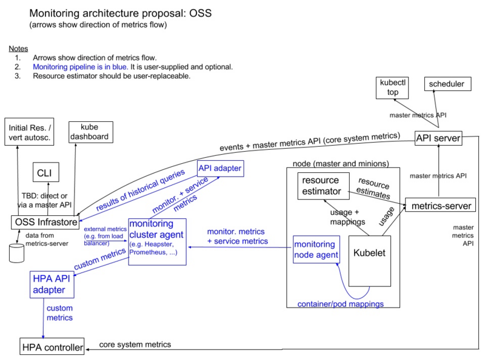
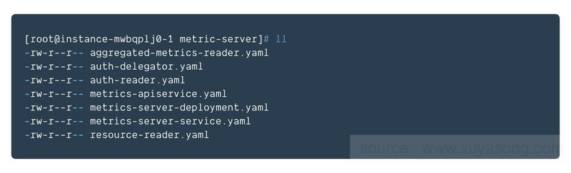
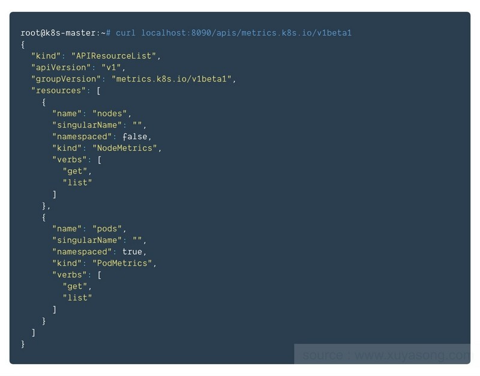

二十 监控系统
===========================

kubectl top 是 k8s 内置查看 POD 监控信息的命令，它从监控系统中获得 metrics


## 20.1 退休的[heapster](https://github.com/kubernetes-retired/heapster)

**heapster 是一个已经废弃的项目,它是早期kubectl top的监控组件**

kubectl 有一个内置插件，叫 cAdvisor 它用来收集 node 节点和节点上的 POD
上的资源使用量，heapster 可以收集 cAdvisor
在每个节点上采集的数据，这些数据想要持续存储，那么就必须将数据放在
influx DB 的数据库中，然后可以使用 Grafana 配置 influx DB
为数据源，然后展示。

### 20.1.1 安装 influx DB

influx DB
是一个时序数据库，它需要一个持久存储来保存数据，所以要注意的是在它的清单文件中应该将官方默认的
emptyDir 修改为具有持久存储能力的存储卷。

-   heapster/deploy/kube-config/influxdb/influxdb.yaml

``` yaml
apiVersion: apps/v1                     # 此处修改为 apps/v1，由于修改了此处所以还需要修改标签选择器
kind: Deployment
metadata:
  name: monitoring-influxdb
  namespace: kube-system
spec:
  replicas: 1
  selector:                             # 添加标签
    matchLables:                        # 添加标签
      task: monitoring                  # 添加标签
      k8s-app: influxdb                 # 添加标签
  template:
    metadata:
      labels:
        task: monitoring
        k8s-app: influxdb
    spec:
      containers:
      - name: influxdb
        image: k8s.gcr.io/heapster-influxdb-amd64:v1.5.2
        volumeMounts:
        - mountPath: /data
          name: influxdb-storage
      volumes:
      - name: influxdb-storage
        emptyDir: {}                    # 此处应该修改为具有持久存储能力的
---
apiVersion: v1
kind: Service
metadata:
  labels:
    task: monitoring
    # For use as a Cluster add-on (https://github.com/kubernetes/kubernetes/tree/master/cluster/addons)
    # If you are NOT using this as an addon, you should comment out this line.
    kubernetes.io/cluster-service: 'true'
    kubernetes.io/name: monitoring-influxdb
  name: monitoring-influxdb
  namespace: kube-system
spec:
  ports:
  - port: 8086
    targetPort: 8086
  selector:
    k8s-app: influxdb
```

-   查看 service 和 pod

``` {.bash}
$ kubectl get svc -n kube-system
NAME                   TYPE        CLUSTER-IP       EXTERNAL-IP   PORT(S)                  AGE
kube-dns               ClusterIP   10.96.0.10       <none>        53/UDP,53/TCP,9153/TCP   9d
kubernetes-dashboard   NodePort    10.109.5.194     <none>        443:30894/TCP            3d14h
monitoring-influxdb    ClusterIP   10.104.173.236   <none>        8086/TCP                 18s

$ kubectl get pod -n kube-system
NAME                                    READY   STATUS    RESTARTS   AGE
.....
monitoring-influxdb-866db5f944-d7rkd    1/1     Running   0          69s
```

### 20.1.2 安装 heapster

-   首先安装 rbac
    的用户，heapster/deploy/kube-config/rbac/heapster-rbac.yaml

``` yaml
kind: ClusterRoleBinding
apiVersion: rbac.authorization.k8s.io/v1beta1
metadata:
  name: heapster
roleRef:
  apiGroup: rbac.authorization.k8s.io
  kind: ClusterRole
  name: system:heapster
subjects:
- kind: ServiceAccount
  name: heapster
  namespace: kube-system
```

-   安装 heapster，heapster/deploy/kube-config/influxdb/heapster.yaml

``` yaml
apiVersion: v1
kind: ServiceAccount
metadata:
  name: heapster
  namespace: kube-system
---
apiVersion: apps/v1                    # 修改此处的为 apps/v1，修改此处以后还需要添加 selector 
kind: Deployment
metadata:
  name: heapster
  namespace: kube-system
spec:
  replicas: 1
  selector:                           # 因为修改 api 版本所以需要添加
    matchLabels:                      # 添加
      task: monitoring                # 添加
      k8s-app: heapster               # 添加
  template:
    metadata:
      labels:
        task: monitoring
        k8s-app: heapster
    spec:
      serviceAccountName: heapster
      containers:
      - name: heapster
        image: k8s.gcr.io/heapster-amd64:v1.5.4
        imagePullPolicy: IfNotPresent
        command:
        - /heapster
        - --source=kubernetes:https://kubernetes.default
        - --sink=influxdb:http://monitoring-influxdb.kube-system.svc:8086
---
apiVersion: v1
kind: Service
metadata:
  labels:
    task: monitoring
    kubernetes.io/cluster-service: 'true'
    kubernetes.io/name: Heapster
  name: heapster
  namespace: kube-system
spec:
  ports:
  - port: 80
    targetPort: 8082
  selector:
    k8s-app: heapster
```

-   查看结果，kubectl get pods -n kube-system

```html
<!-- -->
```
    NAME                                    READY   STATUS    RESTARTS   AGE
    ...
    heapster-5d4bf58946-6dmgf               1/1     Running   0          113s
    monitoring-influxdb-866db5f944-d7rkd    1/1     Running   0          23m

### 20.1.3 安装 Grafana

-   安装 Grafana 清单：heapster/deploy/kube-config/influxdb/grafana.yaml

``` yaml
apiVersion: apps/v1                # 修改此处为 apps/v1
kind: Deployment
metadata:
  name: monitoring-grafana
  namespace: kube-system
spec:
  replicas: 1
  selector:                        # 由于修改了 api 版本，所以增加此处
    matchLabels:                   # 标签选择器
      task: monitoring             # 标签选择器
      k8s-app: grafana             # 标签选择器
  template:
    metadata:
      labels:
        task: monitoring
        k8s-app: grafana
    spec:
      containers:
      - name: grafana
        image: k8s.gcr.io/heapster-grafana-amd64:v5.0.4
        ports:
        - containerPort: 3000
          protocol: TCP
        volumeMounts:
        - mountPath: /etc/ssl/certs
          name: ca-certificates
          readOnly: true
        - mountPath: /var
          name: grafana-storage
        env:
        - name: INFLUXDB_HOST
          value: monitoring-influxdb
        - name: GF_SERVER_HTTP_PORT
          value: "3000"
        - name: GF_AUTH_BASIC_ENABLED
          value: "false"
        - name: GF_AUTH_ANONYMOUS_ENABLED
          value: "true"
        - name: GF_AUTH_ANONYMOUS_ORG_ROLE
          value: Admin
        - name: GF_SERVER_ROOT_URL
          value: /
      volumes:
      - name: ca-certificates
        hostPath:
          path: /etc/ssl/certs              # 注意配置 ssl 证书
      - name: grafana-storage
        emptyDir: {}                       # 注意配置持久存储
---
apiVersion: v1
kind: Service
metadata:
  labels:
    kubernetes.io/cluster-service: 'true'
    kubernetes.io/name: monitoring-grafana
  name: monitoring-grafana
  namespace: kube-system
spec:
  type: NodePort                         # 如果需要通过外部访问可以打开，可以关闭 heapster 的此项
  ports:
  - port: 80
    targetPort: 3000
  selector:
    k8s-app: grafana
```

## 20.2 新生的[metrics-server](https://github.com/kubernetes-sigs/metrics-server)

**该节内容根据[容器监控实践—Metrics Server](https://segmentfault.com/a/1190000017875578)重新排版编辑而成**

从 v1.8 开始，资源使用情况的监控可以通过 Metrics API的形式获取，具体的组件为Metrics Server，用来替换之前的heapster，heapster从1.11开始逐渐被废弃。

Metrics-Server是集群核心监控数据的聚合器，从 Kubernetes1.8 开始，它作为一个 Deployment对象默认部署在由kube-up.sh脚本创建的集群中，如果是其他部署方式需要单独安装，或者咨询对应的云厂商。

### 20.2.1 Metrics API

介绍Metrics-Server之前，必须要提一下Metrics API的概念

Metrics API相比于之前的监控采集方式(hepaster)是一种新的思路，官方希望核心指标的监控应该是稳定的，版本可控的，且可以直接被用户访问(例如通过使用 kubectl top 命令)，或由集群中的控制器使用(如HPA)，和其他的Kubernetes APIs一样。

官方废弃heapster项目，就是为了将核心资源监控作为一等公民对待，即像pod、service那样直接通过api-server或者client直接访问，不再是安装一个hepater来汇聚且由heapster单独管理。

假设每个pod和node我们收集10个指标，从k8s的1.6开始，支持5000节点，每个节点30个pod，假设采集粒度为1分钟一次，则：
```
10 x 5000 x 30 / 60 = 25000 平均每分钟2万多个采集指标
```

因为k8s的api-server将所有的数据持久化到了etcd中，显然k8s本身不能处理这种频率的采集，而且这种监控数据变化快且都是临时数据，因此需要有一个组件单独处理他们，k8s版本只存放部分在内存中，于是metric-server的概念诞生了。

其实hepaster已经有暴露了api，但是用户和Kubernetes的其他组件必须通过master proxy的方式才能访问到，且heapster的接口不像api-server一样，有完整的鉴权以及client集成。这个api现在还在alpha阶段（18年8月），希望能到GA阶段。类api-server风格的写法：[generic apiserver](https://github.com/kubernetes/apiserver)

有了Metrics Server组件，也采集到了该有的数据，也暴露了api，但因为api要统一，如何将请求到api-server的/apis/metrics请求转发给Metrics Server呢，解决方案就是：kube-aggregator,在k8s的1.7中已经完成，之前Metrics Server一直没有面世，就是耽误在了[kube-aggregator](https://github.com/kubernetes/kube-aggregator)这一步。

kube-aggregator（聚合api）主要提供：

- Provide an API for registering API servers.
- Summarize discovery information from all the servers.
- Proxy client requests to individual servers.

[详细设计文档](https://github.com/kubernetes/community/blob/master/contributors/design-proposals/api-machinery/aggregated-api-servers.md)

metric api的使用：

- Metrics API 只可以查询当前的度量数据，并不保存历史数据
- Metrics API URI 为 /apis/metrics.k8s.io/，在 k8s.io/metrics 维护
- 必须部署 metrics-server 才能使用该 API，metrics-server 通过调用 Kubelet Summary API 获取数据
如：
```
http://127.0.0.1:8001/apis/metrics.k8s.io/v1beta1/nodes

http://127.0.0.1:8001/apis/metrics.k8s.io/v1beta1/nodes/<node-name>

http://127.0.0.1:8001/apis/metrics.k8s.io/v1beta1/namespace/<namespace-name>/pods/<pod-name>
```

### 20.2.2 Metrics-Server 设计架构

Metrics server定时从Kubelet的Summary API(类似/ap1/v1/nodes/nodename/stats/summary)采集指标信息，这些聚合过的数据将存储在内存中，且以metric-api的形式暴露出去。

Metrics server复用了api-server的库来实现自己的功能，比如鉴权、版本等，为了实现将数据存放在内存中吗，去掉了默认的etcd存储，引入了内存存储（即实现[Storage interface](https://github.com/kubernetes/apiserver/blob/master/pkg/registry/rest/rest.go))。因为存放在内存中，因此监控数据是没有持久化的，可以通过第三方存储来拓展，这个和heapster是一致的。



Metrics server出现后，新的​Kubernetes 监控架构将变成上图的样子

1. 核心流程（黑色部分）：这是 Kubernetes正常工作所需要的核心度量，从 Kubelet、cAdvisor 等获取度量数据，再由metrics-server提供给 Dashboard、HPA 控制器等使用。
1. 监控流程（蓝色部分）：基于核心度量构建的监控流程，比如 Prometheus 可以从 metrics-server 获取核心度量，从其他数据源（如 Node Exporter 等）获取非核心度量，再基于它们构建监控告警系统。

### 20.2.3 使用 Metrics Server

如上文提到的，metric-server是扩展的apiserver，依赖于kube-aggregator，因此需要在apiserver中开启相关参数。

```bash
--requestheader-client-ca-file=/etc/kubernetes/certs/proxy-ca.crt
--proxy-client-cert-file=/etc/kubernetes/certs/proxy.crt
--proxy-client-key-file=/etc/kubernetes/certs/proxy.key
--requestheader-allowed-names=aggregator
--requestheader-extra-headers-prefix=X-Remote-Extra-
--requestheader-group-headers=X-Remote-Group
--requestheader-username-headers=X-Remote-User
```

注意更换镜像地址为国内镜像

`kubectl create -f metric-server/`



安装成功后，访问地址api地址为：



Metrics Server的资源占用量会随着集群中的Pod数量的不断增长而不断上升，因此需要
addon-resizer垂直扩缩这个容器。addon-resizer依据集群中节点的数量线性地扩展Metrics Server，以保证其能够有能力提供完整的metrics API服务。具体参考：[链接](https://github.com/kubernetes/autoscaler/tree/master/addon-resizer)

### 20.2.4 其他

[基于Metrics Server的HPA](http://blog.51cto.com/ylw6006/2115087)

kubernetes的新监控体系中，metrics-server属于Core metrics(核心指标)，提供API metrics.k8s.io，仅提供Node和Pod的CPU和内存使用情况。而其他Custom Metrics(自定义指标)由Prometheus等组件来完成，后续文章将对自定义指标进行解析。

本文为容器监控实践系列文章，完整内容见：[container-monitor-book](https://github.com/yasongxu/container-monitor)
